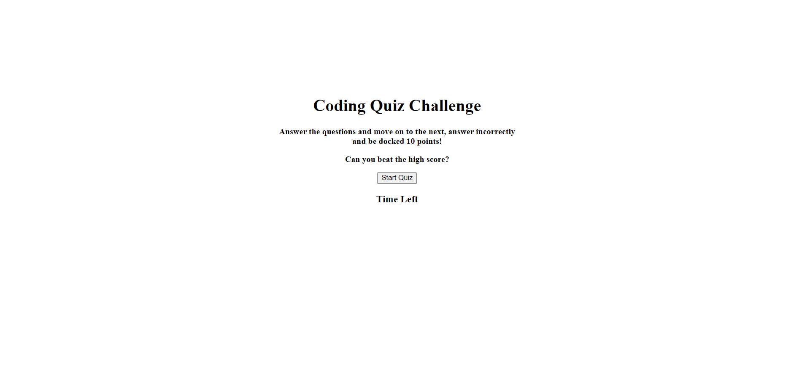

# justAnswerTheQuestion

  ## Description
  
  This is a small coding quiz that tests the user's knowledge of basic coding.
  
  ## Table of Contents
  
  - [Installation](#installation)
  - [Usage](#usage)
  - [License](#license)
  - [Badges](#badges)
  - [Questions](#questions)
  
  ## Installation
  
  There is nothing to install. the quiz will prompt you from the start.
  
  ## Usage
  
  Provide instructions and examples for use. Follow the prompts and answer the questions.

 
  ## License
  
 This project uses a(n) MIT license.
  
  ## Badges
  
  
  
  ## Questions
  
  MY github username is Thoufty and you can reach it here github.com/Thoufty. For any other questions please email me[Tom Houf] at Thomasjhouf@gmail.com.
